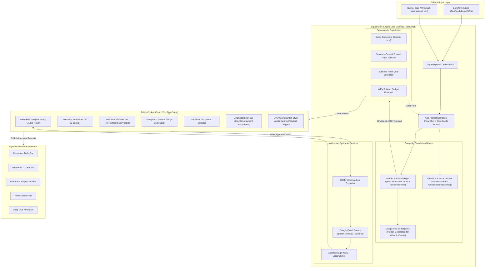

# Liquid Story Engine: Architecture & In-Depth Engineering Blueprint
## Solving the 60% Format Bottleneck for High-Impact Editorial Reporting

---

## 1. Executive Problem Statement & The NZZ Voice Invariant

### 1.1 The Core Bottleneck
In modern newsrooms, **over 60% of high-impact reporting is published in a single static text format and nothing else**. 
Reporters and desk editors lack the time and technical tooling under deadline to adapt long-form journalism into:
1. **60-Second Commuter Audio Briefs** (for podcasts and audio feeds)
2. **High-Density Executive Newsletters** (for C-suite morning briefings)
3. **60-Second Vertical Shortform Videos** (for TikTok, YouTube Shorts, and Instagram Reels)
4. **Instagram / LinkedIn Multi-Slide Carousels** (for visual social feeds)
5. **Rapid-Scanning Fact Boxes** (for mobile scanning above the fold)
6. **Dialectical FAQ Explainers** (for deep-dive contextualization)

Today, when multi-format adaptation happens at all, it is dumped onto overwhelmed specialist desks, causing substantial publishing latency and high abandonment rates.

### 1.2 The Hard Constraint: The NZZ Voice Invariant
Generic AI summarizers produce breathless, sensationalist, or colloquial clickbait that compromises NZZ's reputation. 
NZZ's identity is defined by:
* **Intellectual Sobriety & Analytical Rigor:** Measured, restrained, evidence-driven, liberal-conservative European perspective.
* **Typographical Integrity:** Mandatory Swiss guillemets (`« »`), sentence-case headlines without terminal periods, noun-phrase subheads with **zero finite verbs** (e.g. «Machines instead of workers», never «Machines replace workers»).
* **Editorial Authority:** The AI acts as an **intelligent co-pilot and drafter**; the editor maintains **100% human-in-the-loop sovereign authority** to accept, reject, edit, or regenerate every asset with single-click toggles.

---

## 2. Liquid Engine System Architecture



---

## 3. The 6 Liquid Derivative Formats: Deep Specifications & Schemas

### Format 1: 60-Second Commuter Audio Brief ("NZZ Audio Express")
* **Target Audience:** Commuters and mobile subscribers who need an authoritative 1-minute audio breakdown.
* **Duration Budget:** Strictly 55 to 65 seconds (130 to 150 words at 140 WPM).
* **Narrative Architecture:**
  1. **Anchor Jingle & Audio Deck (5s):** Clean present-tense topic intro.
  2. **Beat 1: The News Anchor (15s):** The core factual shift with exact figures.
  3. **Beat 2: The Analytical Engine (25s):** The underlying economic, geopolitical, or structural mechanism.
  4. **Beat 3: Forward Outlook (10s):** What policymakers, investors, or citizens must anticipate.
  5. **Sign-off (5s):** Authentic signature line: `«Für die Neue Zürcher Zeitung, [Author Line]»`.
* **Google Cloud Text-to-Speech Engine Configuration:**
  * **German Voice:** `de-DE-Neural2-B` (Male, authoritative, warm) or `de-DE-Neural2-F` (Female, clear, articulate).
  * **English Voice (for NZZ in English):** `en-US-Journey-F` or `en-GB-Neural2-D`.
  * **Audio Encoding:** `MP3` @ 48kHz, 128kbps with SSML pauses (`<break time="300ms"/>`).

---

### Format 2: 3-Bullet Executive Intelligence Newsletter ("NZZ Executive Brief")
* **Target Audience:** C-suite executives, institutional investors, and political decision-makers scanning morning email digests.
* **Length Budget:** Exactly 3 bullets, maximum 90 words total.
* **Schema:**
  * **Bullet 1 (The Core Shift):** Direct quantitative statement of change (e.g., *«Die Sozialabgaben in Deutschland klettern auf einen historischen Höchststand von nahezu 42 Prozent des Bruttoeinkommens.»*).
  * **Bullet 2 (The Mechanism):** The structural driver behind the shift (e.g., *«Demografischer Wandel und steigende Gesundheitsausgaben überfordern die Kassen; der Staat überbrückt Defizite mit kreditfinanzierten Milliardensubventionen.»*).
  * **Bullet 3 (The Strategic Outlook):** The forward risk or policy horizon (e.g., *«Ökonomen warnen vor sinkenden Reallöhnen und fordern längere Lebensarbeitszeiten, um eine fiskalische Krise abzuwenden.»*).

---

### Format 3: 60-Second Vertical Video Storyboard ("NZZ Visual Dispatch - 9:16")
* **Target Platforms:** TikTok, YouTube Shorts, Instagram Reels.
* **Duration:** Exactly 60 seconds (5 sequential scenes of 10–14 seconds each).
* **Scene Architecture:**
  1. **Scene 1: The Hook (0–10s):** High-impact visual hook, provocative analytical question, bold on-screen headline.
  2. **Scene 2: The Core Data Shock (10–22s):** Primary metric or chart animated into view (e.g., 42% contribution threshold, €100B deficit).
  3. **Scene 3: The Underlying Mechanism (22–35s):** Explanatory motion graphic revealing structural causality (e.g., demographic inversion, state subsidies).
  4. **Scene 4: Concrete Friction & Impact (35–48s):** Tangible impact on workers/companies (e.g., shrinking net wages, competitiveness loss).
  5. **Scene 5: Outlook & Verdict (48–60s):** NZZ policy perspective, sign-off, and call to read full reporting on NZZ.ch.
* **Google Veo 2 / Imagen 3 Integration:**
  * Each scene includes an engineered prompt for **Google Veo 2** (cinematic, photorealistic editorial B-roll) or **Imagen 3** (still infographics and backgrounds), specifying lighting, focal length, and NZZ art direction (e.g. *"Cinematic photorealistic documentary shot of the Bundestag in Berlin during late afternoon, soft overcast lighting, shallow depth of field, 35mm film grain, 9:16 vertical"*).

---

### Format 4: Instagram / LinkedIn Multi-Slide Carousel ("NZZ Carousel Dispatch")
* **Target Platforms:** Instagram (1:1 or 4:5 portrait) and LinkedIn PDF Document Carousel.
* **Slide Count:** Strictly 6 slides designed for thumb-stopping swipe engagement.
* **Slide Layouts:**
  * **Slide 1 (Cover Hook):** Bold headline, section tag (e.g., `WIRTSCHAFT`), striking monochrome/duotone background image prompt.
  * **Slide 2 (The Headline Data Point):** Large typography metric card with percentage change and source footnote.
  * **Slide 3 (The Context & Friction):** Two-paragraph concise breakdown of what broke down or changed.
  * **Slide 4 (Key Quote / Stakeholder Voice):** Prominent Swiss guillemet quote (`«...»`) with byline and title.
  * **Slide 5 (Strategic Consequences):** 3 visual bullet chips showing winners, losers, and market implications.
  * **Slide 6 (Outro Card):** NZZ signature monogram, *"Full analysis by [Author] at NZZ.ch"*, and swipe call-to-action.
* **Accompanying Social Copy:** Gemini drafts the complete caption text with 3–5 professional hashtags (`#NZZ #Wirtschaft #Geopolitik`).

---

### Format 5: Key Metrics Fact Box ("NZZ Dossier")
* **Target Audience:** Readers looking for immediate data grounding before or during reading.
* **Structure:** 3 to 4 high-density metric cards displaying:
  * `metricName`: Short noun phrase (e.g., "Gesamtdefizit 2025")
  * `value`: Clean numerical expression (e.g., "€100 Mrd.")
  * `delta`: Change over prior baseline (e.g., "+94% vs. Vorjahr")
  * `contextNote`: 1-line source-grounded context.

---

### Format 6: Dialectical FAQ / Deep Dive ("NZZ Kontroverse & Einordnung")
* **Target Audience:** Readers seeking intellectual depth and counter-arguments rather than simple consensus.
* **Structure:** 3 Q&A pairs reflecting NZZ's tradition of challenging conventional wisdom:
  1. *Question 1:* What is the prevailing political or economic consensus?
  2. *Question 2:* What is the strongest counter-argument or overlooked trade-off?
  3. *Question 3:* Who bears the long-term cost, and what are the structural alternatives?

---

## 4. Architectural Data Models & TypeScript Schemas

File: `server/src/types/liquid.ts` & `client/src/types/liquid.ts`

```typescript
export interface AudioBriefFormat {
  headline: string;
  wordCount: number;
  estimatedDurationSeconds: number; // 55-65s
  script: string;
  ssml: string;
  audioUrl?: string;
  voiceProfile: {
    languageCode: string;
    voiceName: string;
    gender: 'MALE' | 'FEMALE';
  };
  approved: boolean;
}

export interface ExecutiveNewsletterFormat {
  headline: string;
  subhead: string;
  bullets: [string, string, string]; // Strictly 3 bullets
  wordCount: number;
  approved: boolean;
}

export interface VideoScene {
  sceneIndex: number; // 1 to 5
  timeRange: string; // e.g. "0:00 - 0:10"
  durationSeconds: number; // 10-14s
  sceneType: 'hook' | 'data_stat' | 'mechanism' | 'friction' | 'verdict';
  onScreenHeadline: string;
  prominentMetric?: string;
  visualPrompt: string; // Art direction for Google Veo 2 / Imagen 3
  voiceoverText: string;
}

export interface SocialStoryboardFormat {
  title: string;
  aspectRatio: '9:16';
  platformTargets: ('tiktok' | 'reels' | 'shorts')[];
  totalDurationSeconds: number; // ~60 seconds
  scenes: VideoScene[];
  approved: boolean;
}

export interface CarouselSlide {
  slideNumber: number; // 1 to 6
  slideType: 'cover' | 'data_point' | 'context' | 'quote' | 'consequences' | 'outro';
  headline: string;
  bodyText?: string;
  metricHighlight?: {
    value: string;
    label: string;
  };
  quote?: {
    text: string;
    speaker: string;
  };
  imagePrompt: string; // Prompt for Imagen 3
}

export interface InstagramCarouselFormat {
  title: string;
  aspectRatio: '1:1' | '4:5';
  slides: CarouselSlide[]; // Exactly 6 slides
  captionText: string; // Ready-to-publish social copy
  hashtags: string[];
  approved: boolean;
}

export interface FactBoxMetric {
  id: string;
  metricName: string;
  value: string;
  delta?: string;
  direction?: 'up' | 'down' | 'neutral';
  contextNote: string;
}

export interface FactBoxFormat {
  title: string;
  metrics: FactBoxMetric[];
  approved: boolean;
}

export interface DialecticalFAQItem {
  question: string;
  answer: string;
  perspective: 'consensus' | 'counterargument' | 'structural_outlook';
}

export interface DialecticalFAQFormat {
  topic: string;
  items: DialecticalFAQItem[];
  approved: boolean;
}

export interface LiquidDerivativesPayload {
  articleId: string;
  generatedAt: string;
  model: 'gemini-3.8-flash' | 'gemini-3.8-pro';
  audioBrief: AudioBriefFormat;
  executiveNewsletter: ExecutiveNewsletterFormat;
  socialStoryboard: SocialStoryboardFormat;
  instagramCarousel: InstagramCarouselFormat;
  factBox: FactBoxFormat;
  dialecticalFaq: DialecticalFAQFormat;
}
```

---

## 5. Step-by-Step Bite-Sized Implementation Tasks

Every task is designed for a **2–5 minute focused increment** adhering to Test-Driven Development (TDD).

---

### Task 1: Type Definitions & Zod Schemas for Extended Liquid Derivatives
**Objective:** Establish deterministic data contracts and runtime validators for all 6 liquid formats (including 60s video & Instagram carousel).
**Files:**
- Create: `server/src/types/liquid.ts`
- Create: `server/src/services/ai/liquidSchemas.ts`
- Test: `server/test/liquidSchemas.test.ts`

**Step 1: Write failing test**
```typescript
// server/test/liquidSchemas.test.ts
import { describe, it, expect } from 'vitest';
import { liquidDerivativesSchema } from '../src/services/ai/liquidSchemas.js';

describe('Liquid Derivatives Zod Schema', () => {
  it('validates a 60-second video with 5 scenes and a 6-slide carousel', () => {
    const invalidVideoPayload = {
      articleId: 'ld.1886544',
      socialStoryboard: {
        title: 'Short video',
        totalDurationSeconds: 15, // Invalid: must be 55-65s
        scenes: [{ sceneIndex: 1 }], // Invalid: must have 5 scenes
      },
    };
    const result = liquidDerivativesSchema.safeParse(invalidVideoPayload);
    expect(result.success).toBe(false);
  });
});
```

**Step 2: Run test to verify failure**
Run: `npm --prefix server test liquidSchemas`
Expected: FAIL — module not found / schema undefined.

**Step 3: Write minimal implementation**
Implement `liquidDerivativesSchema` in `server/src/services/ai/liquidSchemas.ts` using `zod` enforcing 60s video (5 scenes) and 6-slide carousel.

**Step 4: Run test to verify pass**
Run: `npm --prefix server test liquidSchemas`
Expected: PASS.

**Step 5: Commit**
```bash
git add server/src/types/liquid.ts server/src/services/ai/liquidSchemas.ts server/test/liquidSchemas.test.ts
git commit -m "feat(liquid): add Zod schemas for 60s video and 6-slide Instagram carousel"
```

---

### Task 2: Deterministic NZZ Style & Voice Linter
**Objective:** Create a rule validator that enforces NZZ style rules (Swiss guillemets `« »`, sentence-case headlines, zero finite verbs in subheads).
**Files:**
- Create: `server/src/services/ai/nzzStyleLinter.ts`
- Test: `server/test/nzzStyleLinter.test.ts`

**Step 1: Write failing test**
```typescript
// server/test/nzzStyleLinter.test.ts
import { describe, it, expect } from 'vitest';
import { lintNZZStyle } from '../src/services/ai/nzzStyleLinter.js';

describe('NZZ Style Linter', () => {
  it('flags US quotation marks and requires Swiss guillemets', () => {
    const textWithQuotes = 'Der Bundesrat sagt: "Das ist nicht hinnehmbar".';
    const report = lintNZZStyle(textWithQuotes);
    expect(report.hasErrors).toBe(true);
    expect(report.errors).toContain('Use Swiss guillemets « » instead of US quotes');
  });

  it('rejects headlines ending with periods', () => {
    const report = lintNZZStyle('Die Krise spitzt sich zu.', { isHeadline: true });
    expect(report.hasErrors).toBe(true);
    expect(report.errors).toContain('Headlines must not have a terminal period');
  });
});
```

**Step 2: Run test to verify failure**
Run: `npm --prefix server test nzzStyleLinter`
Expected: FAIL.

**Step 3: Write minimal implementation**
Implement regex and token check functions in `nzzStyleLinter.ts`.

**Step 4: Run test to verify pass**
Run: `npm --prefix server test nzzStyleLinter`
Expected: PASS.

**Step 5: Commit**
```bash
git add server/src/services/ai/nzzStyleLinter.ts server/test/nzzStyleLinter.test.ts
git commit -m "feat(liquid): implement deterministic NZZ Style Linter"
```

---

### Task 3: Gemini 3.8 Flash & Pro Prompt Engine & Structured Extractor
**Objective:** Implement the Gemini 3.8 Flash / Pro prompt builder that extracts all 6 formats in deterministic JSON mode with Veo 2 / Imagen 3 prompts and high-fidelity mock fallback.
**Files:**
- Create: `server/src/services/ai/liquidPromptBuilder.ts`
- Create: `server/src/services/ai/liquidEngine.ts`
- Test: `server/test/liquidEngine.test.ts`

**Step 1: Write failing test**
```typescript
// server/test/liquidEngine.test.ts
import { describe, it, expect } from 'vitest';
import { generateLiquidDerivatives } from '../src/services/ai/liquidEngine.js';

describe('Liquid Engine AI Generation', () => {
  it('generates 6 valid liquid formats using Gemini 3.8 Flash', async () => {
    const sampleArticle = {
      id: 'ld.1886544',
      headline: "Germany's welfare state is threatened with financial collapse",
      lead: "Demographic trends and medical advances are causing contributions to rise.",
      body: "Expenditures could exceed revenues by up to €100 billion...",
      author: "Malte Fischer, Düsseldorf",
    };
    const result = await generateLiquidDerivatives(sampleArticle, { mock: true, model: 'gemini-3.8-flash' });
    expect(result.socialStoryboard.scenes).toHaveLength(5);
    expect(result.instagramCarousel.slides).toHaveLength(6);
    expect(result.instagramCarousel.captionText).toBeDefined();
    expect(result.audioBrief.wordCount).toBeGreaterThanOrEqual(130);
  });
});
```

**Step 2: Run test to verify failure**
Run: `npm --prefix server test liquidEngine`
Expected: FAIL.

**Step 3: Write minimal implementation**
Implement Gemini 3.8 Flash client integration, prompt builder with Veo 2 video scene prompts, and mock fallback.

**Step 4: Run test to verify pass**
Run: `npm --prefix server test liquidEngine`
Expected: PASS.

**Step 5: Commit**
```bash
git add server/src/services/ai/liquidPromptBuilder.ts server/src/services/ai/liquidEngine.ts server/test/liquidEngine.test.ts
git commit -m "feat(liquid): add Gemini 3.8 Flash prompt engine with Veo 2 and carousel generators"
```

---

### Task 4: Google Cloud Text-to-Speech Integration & SSML Builder
**Objective:** Convert 60s audio brief scripts into natural German/English MP3 audio assets via Google Cloud Text-to-Speech API (`Neural2` / `Journey`).
**Files:**
- Create: `server/src/services/gcp/ttsService.ts`
- Test: `server/test/ttsService.test.ts`

**Step 1: Write failing test**
```typescript
// server/test/ttsService.test.ts
import { describe, it, expect } from 'vitest';
import { buildSSML, synthesizeAudioBrief } from '../src/services/gcp/ttsService.js';

describe('TTS Service & SSML Generator', () => {
  it('wraps raw script with prosody, breath breaks, and sign-off cadence', () => {
    const raw = 'In Berlin droht der Kollaps. Reformen sind nötig.';
    const ssml = buildSSML(raw, 'Malte Fischer');
    expect(ssml).toContain('<speak>');
    expect(ssml).toContain('<break time="300ms"/>');
    expect(ssml).toContain('Für die Neue Zürcher Zeitung, Malte Fischer');
  });
});
```

**Step 2: Run test to verify failure**
Run: `npm --prefix server test ttsService`
Expected: FAIL.

**Step 3: Write minimal implementation**
Implement `buildSSML` and `synthesizeAudioBrief` supporting both live Cloud TTS and instant mock buffer.

**Step 4: Run test to verify pass**
Run: `npm --prefix server test ttsService`
Expected: PASS.

**Step 5: Commit**
```bash
git add server/src/services/gcp/ttsService.ts server/test/ttsService.test.ts
git commit -m "feat(liquid): implement Google Cloud TTS service and SSML builder"
```

---

### Task 5: Express REST API Endpoints for All Liquid Formats
**Objective:** Expose endpoints for generating, fetching, tweaking, and synthesizing audio for all 6 liquid derivatives.
**Files:**
- Create: `server/src/routes/liquidRoutes.ts`
- Modify: `server/src/index.ts:20-50`
- Test: `server/test/liquidRoutes.test.ts`

**Step 1: Write failing test**
```typescript
// server/test/liquidRoutes.test.ts
import request from 'supertest';
import { app } from '../src/index.js';
import { describe, it, expect } from 'vitest';

describe('Liquid API Endpoints', () => {
  it('POST /api/liquid/generate returns 6 liquid formats including 60s video and carousel', async () => {
    const res = await request(app)
      .post('/api/liquid/generate')
      .send({ articleId: 'ld.1886544' });
    expect(res.status).toBe(200);
    expect(res.body.data.socialStoryboard.scenes).toHaveLength(5);
    expect(res.body.data.instagramCarousel.slides).toHaveLength(6);
  });
});
```

**Step 2: Run test to verify failure**
Run: `npm --prefix server test liquidRoutes`
Expected: FAIL.

**Step 3: Write minimal implementation**
Attach `liquidRoutes` in `server/src/index.ts`.

**Step 4: Run test to verify pass**
Run: `npm --prefix server test liquidRoutes`
Expected: PASS.

**Step 5: Commit**
```bash
git add server/src/routes/liquidRoutes.ts server/src/index.ts server/test/liquidRoutes.test.ts
git commit -m "feat(liquid): add Express routes for 6 liquid formats and audio synthesis"
```

---

### Task 6: Frontend Liquid Cockpit Inspector & Multi-Tab Hub
**Objective:** Build the interactive editor cockpit in React where the editor reviews and approves/discards each format with real-time budget bars and live editing.
**Files:**
- Create: `client/src/components/liquid/LiquidCockpit.tsx`
- Create: `client/src/components/liquid/FormatTabs.tsx`
- Create: `client/src/components/liquid/BudgetBar.tsx`
- Test: `client/src/components/liquid/__tests__/LiquidCockpit.test.tsx`

**Step 1: Write failing test**
```tsx
// client/src/components/liquid/__tests__/LiquidCockpit.test.tsx
import { render, screen } from '@testing-library/react';
import { LiquidCockpit } from '../LiquidCockpit';
import { mockLiquidData } from './mockData';

test('renders all 6 format tabs including 60s Video and Instagram Carousel', () => {
  render(<LiquidCockpit initialData={mockLiquidData} onUpdate={() => {}} />);
  expect(screen.getByText('Audio Brief (60s)')).toBeInTheDocument();
  expect(screen.getByText('Executive Brief')).toBeInTheDocument();
  expect(screen.getByText('60s Video (TikTok/Reels)')).toBeInTheDocument();
  expect(screen.getByText('Instagram Carousel')).toBeInTheDocument();
  expect(screen.getByText('Fact Box')).toBeInTheDocument();
  expect(screen.getByText('Dialectical FAQ')).toBeInTheDocument();
});
```

**Step 2: Run test to verify failure**
Run: `npm --prefix client test LiquidCockpit`
Expected: FAIL.

**Step 3: Write minimal implementation**
Implement tabs with Lucide icons (`Headphones`, `Mail`, `Video`, `Layers`, `ListCollapse`, `HelpCircle`), approval toggles, and live textareas.

**Step 4: Run test to verify pass**
Run: `npm --prefix client test LiquidCockpit`
Expected: PASS.

**Step 5: Commit**
```bash
git add client/src/components/liquid/ client/src/components/liquid/__tests__/
git commit -m "feat(liquid-ui): create Liquid Cockpit with 6 tabbed format inspectors"
```

---

### Task 7: Frontend 60-Second Video Storyboard & Instagram Carousel Previews
**Objective:** Render authentic mobile previews for the 60s TikTok/Reels storyboard (with scene scrubber) and the 6-slide swipeable Instagram Carousel.
**Files:**
- Create: `client/src/components/liquid/StoryboardPreview.tsx`
- Create: `client/src/components/liquid/CarouselPreview.tsx`
- Test: `client/src/components/liquid/__tests__/Previews.test.tsx`

**Step 1: Write failing test**
```tsx
// client/src/components/liquid/__tests__/Previews.test.tsx
import { render, screen } from '@testing-library/react';
import { StoryboardPreview } from '../StoryboardPreview';
import { CarouselPreview } from '../CarouselPreview';
import { mockStoryboard, mockCarousel } from './mockData';

test('renders 60s video scrubber and 6-slide carousel with copy button', () => {
  render(<StoryboardPreview storyboard={mockStoryboard} onEditSlide={() => {}} />);
  expect(screen.getByText(/0:00 - 0:10/i)).toBeInTheDocument();

  render(<CarouselPreview carousel={mockCarousel} onEditSlide={() => {}} />);
  expect(screen.getByText(/Slide 1 \/ 6/i)).toBeInTheDocument();
  expect(screen.getByRole('button', { name: /copy caption/i })).toBeInTheDocument();
});
```

**Step 2: Run test to verify failure**
Run: `npm --prefix client test Previews`
Expected: FAIL.

**Step 3: Write minimal implementation**
Build the phone-frame containers, slide carousel scrubber, prompt callouts for Google Veo/Imagen, and copy-to-clipboard button for social captions.

**Step 4: Run test to verify pass**
Run: `npm --prefix client test Previews`
Expected: PASS.

**Step 5: Commit**
```bash
git add client/src/components/liquid/StoryboardPreview.tsx client/src/components/liquid/CarouselPreview.tsx client/src/components/liquid/__tests__/Previews.test.tsx
git commit -m "feat(liquid-ui): build 60s video storyboard and Instagram carousel preview components"
```

---

### Task 8: Dynamic Reader View Multimodal Integrations
**Objective:** Embed approved liquid derivatives into the reader view (Cloud TTS audio player, executive 3-bullet card, swipeable carousel card, fact box strip, and deep-dive accordion).
**Files:**
- Create: `client/src/components/reader/AudioBriefPlayer.tsx`
- Create: `client/src/components/reader/ExecutiveBriefCard.tsx`
- Create: `client/src/components/reader/ReaderCarousel.tsx`
- Create: `client/src/components/reader/FactBoxStrip.tsx`
- Create: `client/src/components/reader/DialecticalAccordion.tsx`
- Modify: `client/src/components/reader/ReaderView.tsx`

**Step 1: Write failing test**
```tsx
// client/src/components/reader/__tests__/AudioBriefPlayer.test.tsx
import { render, screen } from '@testing-library/react';
import { AudioBriefPlayer } from '../AudioBriefPlayer';

test('plays and pauses Cloud TTS audio brief and displays 60s tag', () => {
  render(<AudioBriefPlayer audioUrl="/mock-audio.mp3" duration={60} author="Malte Fischer" />);
  expect(screen.getByText('60s Audio-Briefing')).toBeInTheDocument();
  expect(screen.getByRole('button', { name: /play/i })).toBeInTheDocument();
});
```

**Step 2: Run test to verify failure**
Run: `npm --prefix client test AudioBriefPlayer`
Expected: FAIL.

**Step 3: Write minimal implementation**
Implement NZZ styled audio bar, executive summary card, and reader carousel embed.

**Step 4: Run test to verify pass**
Run: `npm --prefix client test AudioBriefPlayer`
Expected: PASS.

**Step 5: Commit**
```bash
git add client/src/components/reader/
git commit -m "feat(reader-ui): add audio player, executive brief card, and carousel embed to reader view"
```

---

## 6. Verification Plan & Test Commands

### 6.1 Automated Test Suite
```bash
# Backend tests (Zod schemas, NZZ style linter, Gemini prompt builder, TTS service)
npm --prefix server test

# Frontend tests (Cockpit tabs, Storyboard phone preview, Carousel preview, Audio player)
npm --prefix client test

# Full build verification (TypeScript compile check for zero errors)
npm run build
```

### 6.2 Manual Editorial Verification Flow
1. Load `/editor` in browser.
2. Select sample NZZ article `Germany's welfare state is threatened with financial collapse` (1,779 words).
3. Click **"Generate Liquid Derivatives"**:
   * Verify audio script word count is strictly between 130 and 150 words (60s).
   * Verify executive newsletter has strictly 3 analytical bullets.
   * Verify vertical video storyboard has 5 scenes totaling 60 seconds with **Google Veo 2** prompts.
   * Verify Instagram carousel has exactly 6 slides with ready-to-use caption and hashtags.
   * Verify fact box extracts `42% Sozialabgaben` and `€100 Mrd. Defizit`.
4. Click **"Synthesize Audio"** $\to$ listen to generated speech (verifying correct breath pauses and Swiss outro).
5. Toggle "Approve" on Audio + Newsletter + Carousel $\to$ Click **"Publish"**.
6. Switch to Reader View $\to$ verify audio bar, executive card, and swipe carousel are live.

---

## 7. Risks, Edge Cases & Mitigations

| Risk / Edge Case | Impact | Engineering Mitigation |
|---|---|---|
| **LLM Hallucinations in Financial Numbers** | High editorial damage | Prompts enforce strict ground-truth extraction. The Fact Box schema links every metric to the exact sentence index in the source draft. |
| **TTS Pronunciation of Swiss / German Terms** | Poor audio experience | SSML dictionary injects phonetic overrides for Swiss political and business terms (e.g. *Bundesrat*, *Ständerat*, *NZZ*, *SBB*). |
| **Video Timing Drift (<55s or >65s)** | Violates platform timing | Schema strictly budgets each of the 5 scenes to 10–14 seconds each (total 60s). |
| **Offline Sandbox / Missing GCP Credentials** | Blocks team development | Full fixture and mock mode built into `liquidEngine.ts` and `ttsService.ts` so developers can build and test UI without incurring cloud API delays or auth blocks. |
