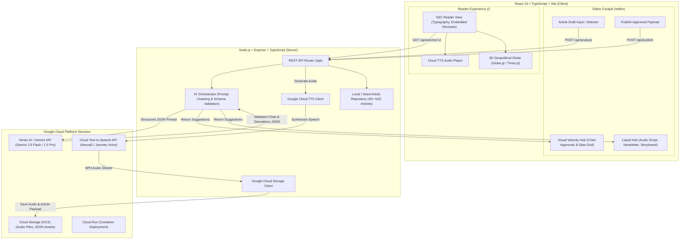

# NZZ Pulse: Editorial Intelligence & Multimodal Publishing Suite
## Hackathon Architecture & Engineering Blueprint (NZZ & Google Cloud)

---

## 1. Executive Summary & Product Vision

### The Problem
* **Visual Velocity Bottleneck:** Over 80% of data-relevant newsroom articles remain static walls of text. Journalists lack time and specialized skills to clean data and configure charts under deadline pressure.
* **Liquid Format Bottleneck:** Over 60% of high-impact reporting is trapped in a single static text format. Transforming reporting into audio briefs, executive newsletters, or vertical storyboards is either ignored or dumped onto overwhelmed specialist desks.
* **Reader Engagement Gap:** Young readers and mobile commuters bounce (~90% bounce rate from social) because dense text fails to match their time budget or medium of choice.

### The Solution: NZZ Pulse
**NZZ Pulse** unifies **Challenge 1 (Liquid Story Engine)** and **Challenge 2 (Visual Velocity)** into a cohesive, high-impact newsroom workflow:
1. **The Editor Cockpit (Back-of-House):** The journalist writes or pastes a draft. One click activates Gemini on Vertex AI to perform dual-track extraction:
   * **Visual Velocity Track:** Detects quantitative claims, comparisons, and temporal series, auto-generating NZZ Q-Tool compatible chart configurations.
   * **Liquid Derivatives Track:** Crafts voice-preserved derivatives (60s Commuter Audio Brief, 3-Bullet Executive Newsletter, 9:16 Social Storyboard, Fact Box Dossier, and Analytical FAQ).
   * **Human-in-the-Loop Hub:** The editor reviews, tweaks data values, and accepts/rejects suggestions with instant live previews.
2. **The Dynamic Reader Experience (Front-of-House):** Published articles render with NZZ's refined Swiss typography, embedded interactive Recharts, native audio briefs synthesized via Google Cloud TTS, and an **Interactive 3D Geopolitical Globe** that lets readers explore international stories geographically.

---

## 2. System Architecture



---

## 3. Google Cloud Services Mapping (Exceeding the 3+ Requirement)

| Service | Specific Role in NZZ Pulse | Value & Hackathon Justification |
|---|---|---|
| **1. Vertex AI / Gemini API** | Dual-track structured JSON extraction (`gemini-2.5-flash` or `gemini-1.5-pro` with responseSchema). | Extracts numerical datasets from unstructured text; drafts editorial derivatives in strict NZZ style. High speed and deterministic JSON formatting. |
| **2. Google Cloud Text-to-Speech** | Converts the approved 60-second commuter script into natural German/English audio (`de-DE-Neural2` / `en-US-Journey-F`). | Solves the commuter friction point directly; eliminates manual podcast voice-over production. |
| **3. Google Cloud Storage (GCS)** | Object storage bucket for generated audio `.mp3` files, published story JSONs, and chart snapshot assets. | Enterprise-grade persistence, fast CDN delivery for mobile readers, decouples frontend from backend compute. |
| **4. Cloud Run** | Hosts containerized Node.js backend and React frontend (Dockerized). | Serverless scale, minimal cold starts, frictionless deployment within the hackathon sandbox. |

---

## 4. Visual Velocity: From Raw Text to NZZ Q-Tool Graphics

### 4.1 NZZ Beat & Data Analysis
Analysis of the provided NZZ articles (`Wirtschaft`, `Finanzen`, `International`, `Technologie`, `Wissenschaft`) reveals key data patterns:
* **Economic & Financial Indicators:** GDP growth rates, inflation comparisons, trade balance (e.g., German exports to China), sovereign debt curves, energy consumption over time.
* **Geopolitical & Security Metrics:** Defense spending (% of GDP), drone strike frequencies, refugee movements, trade strait traffic (Strait of Malacca).
* **Demographics & Science:** Population birth rates (India vs. China), glacier melting cubic meters, temperature anomalies.

### 4.2 Chart Schema: NZZ "Q-Tool" Compatible
The system generates chart specifications matching NZZ's proprietary Q-Tool format:
```json
{
  "visualOpportunityFound": true,
  "confidenceScore": 0.94,
  "rationale": "Article discusses declining German exports to China over 2012-2025 with concrete annual figures in billion Euros.",
  "chartConfig": {
    "title": "Immer weniger deutsche Exporte nach China",
    "subtitle": "Werte der jährlichen Ausfuhren nach China, in Milliarden Euro",
    "chartType": "bar", // bar, line, area, dotplot, donut
    "notes": "* Wert für 2025 geschätzt (Q4 ausstehend)",
    "source": "Statistisches Bundesamt, eigene Berechnungen",
    "xAxisLabel": "Jahr",
    "yAxisLabel": "Mrd. €",
    "data": [
      { "label": "2020", "value": 95.84 },
      { "label": "2021", "value": 103.56 },
      { "label": "2022", "value": 106.76 },
      { "label": "2023", "value": 97.35 },
      { "label": "2024", "value": 89.93 },
      { "label": "2025*", "value": 79.00 }
    ],
    "highlightKey": "2025*"
  }
}
```

### 4.3 Human-in-the-Loop Cockpit Features:
* **Accept / Reject / Regenerate:** Single toggle to approve or dismiss any visual.
* **Inline Data Grid Editor:** Editors can double-click any cell to adjust an axis label or correct a number if the AI misread a nuance.
* **Chart Type Switcher:** Instant toggle between Bar, Line, and Area charts with live Recharts re-rendering.
* **NZZ Style Enforcement:** Palette uses authentic NZZ colors (NZZ Red `#b71c1c` / `#990000`, Deep Slate `#1a202c`, Muted Gray `#e2e8f0`, Swiss typography standards).

---

## 5. The Interactive 3D Geopolitical Globe

### 5.1 Motivation & Placement
* **Front-of-House Reader View:** A sleek globe button with tooltip: *"Geopolitical Perspective"*.
* **Interactive WebGL Globe:** Built using `globe.gl` (Three.js wrapper), styled in dark slate and gold accents matching NZZ's cartography style.
* **Functionality:**
  1. **Country Selection & News Tagging:** Clicking any nation (e.g., Germany, China, Ukraine, Switzerland, India) highlights the country and instantly filters relevant NZZ stories.
  2. **Geopolitical Arcs:** Shows bilateral connections (e.g., Berlin $\leftrightarrow$ Beijing trade flow, US $\leftrightarrow$ Ukraine security cooperation).
  3. **Contextual Story Panel:** Sliding drawer presenting the country's macro indicators and approved charts from recent stories.

---

## 6. Liquid Story Engine: Multi-Format Derivative Suite

To solve the 60% format-trap problem, Gemini generates 5 distinct derivatives adhering to the **NZZ English Style Guide** (Swiss guillemets `« »`, noun-phrase subheads, restrained tone):

1. **60-Second Commuter Audio Brief:**
   * Concise 130-150 word broadcast script.
   * Synthesized into high-fidelity audio via Google Cloud Text-to-Speech (`Neural2`).
   * Rendered in the reader view with a custom mini audio player (play/pause, 1x/1.5x speed, duration).
2. **3-Bullet Executive Newsletter (TL;DR):**
   * High-density summary for C-suite and financial professionals.
   * Analytical rather than sensationalized.
3. **Vertical Video / Social Storyboard:**
   * 4-to-5 scene storyboard designed for 9:16 vertical video (Instagram Reels / LinkedIn Video).
   * Includes: Visual hook, on-screen text overlay, data callout highlight, and narrator voiceover cue.
4. **Key Metrics Fact Box:**
   * 3 to 4 prominent metric cards (e.g., `Export drop: -12.2%`, `Trade Volume: €79B`) displayed as a summary strip.
5. **Analytical FAQ / Deep Dive Accordion:**
   * Anticipates reader skepticism and alternative arguments, honoring NZZ's debate tradition.

---

## 7. Team Division of Labor (5-Person Team Plan)

| Team Member | Role Title | Core Responsibilities & Deliverables | Primary Files / Tech |
|---|---|---|---|
| **Dev 1 (Team Lead)** | **GCP Platform & Backend Lead** | GCP project setup, Cloud Run containerization, Cloud TTS API integration, GCS asset storage service, Express REST routes. | `server/src/services/gcp/`, `server/src/routes/`, `Dockerfile` |
| **Dev 2** | **AI Pipeline & Prompt Engineer** | Gemini 2.5 Flash prompt engineering, Vertex AI SDK integration, strict JSON schemas (`responseSchema`), fallback mocks for offline development. | `server/src/services/ai/`, Gemini system prompts |
| **Dev 3** | **Cockpit & Visual Velocity Lead** | Editor Cockpit UI (`/editor`), NZZ-themed Recharts components, editable data table component, chart type selector, accept/reject toggles. | `client/src/components/editor/`, Recharts styling |
| **Dev 4** | **3D Geopolitical Globe & Reader UI** | Interactive 3D WebGL Globe (`globe.gl`), country selection logic, geopolitical arc links, NZZ editorial reader view (`/article/:id`). | `client/src/components/globe/`, `client/src/components/reader/` |
| **Dev 5** | **Content Ingestion & Demo Master** | Seed database with real NZZ articles (`LiquidStoryEngine` & `VisualVelocity` input datasets), audio player component, end-to-end demo flow, pitch deck metrics. | `server/src/data/seedData.ts`, demo script, pitch slide support |

---

## 8. API Specification

### Endpoints
* `GET /api/articles` — Returns list of seeded NZZ articles with metadata (ID, title, section, published date).
* `GET /api/articles/:id` — Returns full article body, approved charts, and generated derivatives.
* `POST /api/analyze` — Accepts raw text or article ID; invokes Gemini to detect charts and draft liquid derivatives.
* `POST /api/generate-audio` — Accepts text script; calls Google Cloud TTS; uploads MP3 to GCS; returns audio URL.
* `POST /api/publish` — Saves the approved article state (with approved charts and derivatives) to the published repository.
* `GET /api/geopolitical-events` — Returns country-level news data and coordinates for the 3D globe.

---

## 9. Verification & Demo Execution Plan

### Automated & Unit Checks
* Backend builds cleanly with TypeScript (`npm --prefix server run build`).
* Client builds cleanly with Vite (`npm --prefix client run build`).
* API health check (`GET /api/health`) passes.
* Gemini structured output schema validation passes on sample articles.

### The Winning Demo Flow (The 3-Minute Pitch)
1. **The Hook (30s):** Open with the real pain point: 80% of data articles are text walls; 60% stay in one format.
2. **The Editor Workflow (90s):**
   * Paste an NZZ economics article (e.g., German trade with China or Swiss inflation).
   * Click **"Analyze Draft"**.
   * Show Gemini detecting the exact time series and rendering an authentic NZZ bar chart.
   * Editor tweaks a number in the live table, approves the chart, approves the 60s audio script and newsletter.
   * Click **"Publish to Reader"**.
3. **The Reader Experience (60s):**
   * Switch immediately to Reader View.
   * Play the generated Cloud TTS audio brief.
   * View the interactive Recharts embedded within the article text.
   * Click the **Globe Icon**: The 3D globe appears, spin to Germany/China, and show interconnected geopolitical trade data.
