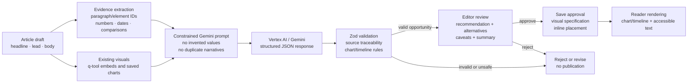

# Visual Velocity architecture

This document describes the current architecture of Visual Velocity, the editorial application for turning articles into discoverable, evidence-backed visual stories. It is a working engineering reference: it records the boundaries that exist today, the contracts between them, and the areas that still need hardening before a high-volume production launch.

## System at a glance

```text
Browser
  |
  v
React application (client/)
  App providers: language -> auth -> articles
  AppShell: navigation, feed, article route, editor surfaces
  Components: reader, visualizer, story globe, liquid studio
  Services: typed API client, HTTP/error boundary, liquid API
  |
  | HTTP / JSON (same-origin /api in production)
  v
Express application (server/)
  middleware: CORS, request ID, JSON parsing, static assets
  routes: auth, articles, story map, liquid generation/publication
  services: article parsing, visual analysis, country classification, AI engines
  repositories: articles, visualizations, countries
  |
  +--> PostgreSQL (articles, visuals, approvals, countries, editors)
  +--> Vertex AI / Gemini (ADC in local and GCP environments)
  +--> q_data assets and generated/static media
```

In production, the server can serve `client/dist` and the API from the same Cloud Run service. During development, Vite serves the frontend and proxies `/api` to the Express server.

### Visual generation pipeline



The browser never calls Gemini or PostgreSQL directly. The backend combines article evidence with existing visual metadata, asks Gemini for candidate visual stories, validates every generated value/event against source IDs, and keeps the editor as the approval boundary before anything is saved or published.

## Repository layout

### Frontend (`client/`)

| Area | Responsibility |
| --- | --- |
| `src/main.tsx` | React bootstrap and strict mode. |
| `src/App.tsx` | Provider composition and application shell entry point. |
| `src/components/` | Screen-level and reusable UI components. Reader, editor, visualization, analytics, and globe experiences live here. |
| `src/components/liquid/` | The Liquid Story Engine/editor surfaces and derivative workflows. |
| `src/context/` | Shared application state: articles, authentication, and language. |
| `src/hooks/` | Route, state, and context access hooks. |
| `src/services/httpClient.ts` | Shared API transport, auth header injection, response envelope handling, and `ApiError`. |
| `src/services/api.ts` | Core article/auth/visualization API operations. |
| `src/services/liquidApi.ts` | Liquid generation and publication API operations; this is a legacy boundary that should converge on `httpClient`. |
| `src/types/` | Shared frontend domain and API types. |
| `src/utils/` | Pure transformations such as section translation and export formatting. |
| `src/App.css`, `src/index.css` | Current global styling and theme layers. `App.css` is still monolithic and is a known refactoring target. |

### Backend (`server/`)

| Area | Responsibility |
| --- | --- |
| `src/index.ts` | Process entry point and server startup. |
| `src/app.ts` | Express composition, middleware, route registration, static client serving, and final error boundary. |
| `src/routes/` | HTTP transport only: validate request inputs, call services/repositories, and format responses. |
| `src/services/` | Application use cases and domain logic. This includes article parsing, visualization analysis, country classification, existing visual extraction, and Liquid generation. |
| `src/repositories/` | PostgreSQL persistence queries and database-shaped data access. |
| `src/config/` | Environment and database configuration. Feature code reads the central environment object rather than parsing process variables directly. |
| `src/types/` | Backend domain contracts for articles, countries, visualizations, and Liquid derivatives. |
| `src/db/migrations/` | Ordered PostgreSQL schema changes. |
| `src/db/seed/` | Seed article and derivative data used by local/demo environments. |
| `src/scripts/` | Explicit operational jobs such as article import and country backfill. |
| `src/services/ai/` | Prompt construction, Gemini/Vertex orchestration, schema validation, caching, and style linting for Liquid output. |

## Frontend runtime and state ownership

The application is intentionally composed in one place so global dependencies are easy to inspect:

```text
LanguageProvider
  -> AuthProvider
    -> ArticleProvider
      -> ErrorBoundary
        -> AppShell
```

State ownership rules:

* `AuthContext` owns the current editor session, token lifecycle, login/logout, and user identity. The token is passed to the API transport through `setApiAuthToken`; components should not construct authorization headers themselves.
* `ArticleContext` owns article list/detail loading and editor mutations (create, update, publish, delete, and saved visualizations). Components consume the context or focused hooks rather than duplicating article fetch state.
* `LanguageContext` owns the active editorial language and localized labels.
* Component state is local when it represents transient UI state: modal visibility, selected chart, hover state, loading indicators, and form drafts.
* Server state should not be copied into multiple contexts without a clear invalidation rule. Mutations should update or invalidate the owning context so feeds and detail pages stay consistent.

The article route is handled by `useArticleRoute` and rendered as a page-level detail experience. The feed and detail page share article data from `ArticleContext`; opening an article should not require a full browser refresh.

## Core frontend flows

### Application boot

1. `main.tsx` mounts React with `StrictMode`.
2. Providers initialize language, auth restoration, and article state.
3. `AppShell` chooses the feed, article detail route, or editor surface.
4. Components request data through service functions, not direct database access.

### Article reading and publication

1. The feed loads lightweight article records.
2. Selecting an article changes the client route and loads its detail record.
3. `ArticleContent` renders the source body and preserves existing visual embeds.
4. Saved generated visuals are placed using their persisted `placement_after_element_id` rather than replacing existing visuals.
5. Editors can save a draft, approve visuals, or publish the article. Viewers only receive published content and have no editor controls.

### Visual analysis

1. An editor clicks **Visualize article** from the article page.
2. The client sends the article identifier to `POST /api/articles/:id/visualizations/analyze`.
3. The server loads the article and existing embedded visuals, then builds a constrained prompt containing paragraph/element identifiers.
4. Gemini returns a structured analysis containing a summary and zero or more opportunities.
5. The server validates the response with Zod and rejects malformed or unsupported output before it reaches the UI.
6. The editor reviews the recommended chart, alternatives, source trace, caveats, and accessibility summary.
7. Saving an opportunity persists a visualization specification and approval history. The reader renders it at the suggested article location.

Supported opportunity types currently include regular charts and timelines. Chart choices include bar, line, area, stacked bar, dot plot, donut, and timeline. A timeline is only valid when its events have source paragraph IDs; it must not be inferred from dates alone or contain invented events.

### Story globe and country discovery

1. The home screen requests lightweight country/story metadata from the story-map API.
2. The globe renders country geometry once and applies story coverage as data-driven interaction state.
3. Countries with no stories remain neutral; coverage intensity is derived from story count rather than hard-coded country styling.
4. Clicking a country requests its associated story summaries. Full article content is loaded only when a story is opened.
5. When enabled, arcs represent relationships between countries in a selected multi-country story. Arcs are interaction state, not permanent decoration.

## Backend request and error model

Express middleware establishes CORS, a request ID, JSON parsing, and static visual assets before route handlers. Async route handlers use `asyncHandler` so rejected promises reach one final error boundary.

Successful API responses use the envelope:

```json
{
  "success": true,
  "data": {}
}
```

Errors use:

```json
{
  "success": false,
  "error": {
    "code": "ERROR_CODE",
    "message": "Human-readable message",
    "details": []
  }
}
```

`sendError`, `sendSuccess`, `HttpError`, and the frontend `ApiError` are the shared contract. New endpoints should use these helpers and return stable machine-readable codes. Request IDs must be retained in server logs and surfaced when useful for support.

Routes should remain thin. Validation, orchestration, database access, and AI calls belong in services/repositories rather than in route callbacks. The service layer is the correct place for authorization-sensitive business rules such as “only editors can save or publish.”

## Persistence model

PostgreSQL is the system of record when configured. The migrations define these main aggregates:

* `articles`: source article metadata, structured body, raw source payload, language, publication status, and timestamps.
* `article_visualizations`: approved/persisted visualization specifications and inline placement element IDs.
* `visualization_approval_history`: audit records for save/clear actions and the stored visual set at that point.
* `article_countries`: article-to-country relationships, relevance/confidence, evidence, and classifier source (`metadata`, `rules`, `gemini`, or `editor`).
* `editor_users`: editor accounts and profile data.

Articles default to a publication status and must be explicitly published before they become viewer-visible. Foreign keys cascade visual and country records when an article is deleted. Indexes support publication ordering, sections, article body search, visualization lookup, and country coverage lookup.

Repositories should own SQL and row mapping. Services should receive domain objects and should not depend on database column naming. Schema changes must be additive/migrated in order and should include indexes and rollback considerations where the deployment process supports them.

## Authentication and authorization

The current editor authentication flow is:

1. `POST /api/auth/login` validates the username and password.
2. The server checks the configured editor store and returns an HMAC-signed bearer token.
3. The frontend stores the session state and configures the shared HTTP client.
4. Protected routes use `requireEditor` and reject missing, invalid, expired, or non-editor claims.

Viewer access is deliberately anonymous and read-only. Authentication is not a viewer requirement. Production hardening still requires replacing development seed credentials, enforcing a strong secret, using a password hashing scheme designed for passwords (Argon2id/bcrypt/scrypt), adding rate limiting, and moving token/session handling to a deliberate secure-cookie or managed identity design.

## Gemini and Google Cloud integration

### Local development

The server uses Google Application Default Credentials (ADC). A developer authenticates with `gcloud auth application-default login` or the approved ADC setup flow, then provides the project through `GOOGLE_CLOUD_PROJECT` or `GCP_PROJECT_ID`. The server does not need a browser flow at request time.

### GCP deployment

The Cloud Run service should use a dedicated service account with only the permissions required to call Vertex AI and access configured data services. ADC then resolves credentials from the Cloud Run runtime identity. Secrets such as database credentials and auth secrets belong in Secret Manager, not source control or a baked image.

### AI boundaries

There are two related AI paths:

* **Visual Velocity analysis** (`services/visualizationService.ts`) uses `@google/genai` with Vertex AI, the configured project/location, and a configured Gemini model. It sends article text plus existing-visual metadata, requests structured JSON, and validates the result with Zod.
* **Liquid Story Engine** (`services/ai/liquidEngine.ts`) builds derivative prompts and invokes Vertex AI using an access token obtained through ADC. It normalizes and validates carousels/derivatives with `liquidSchemas`, caches successful results, and can use deterministic output only when explicitly requested in demo/mock mode.

The AI is advisory, not authoritative. Prompts must require source element IDs, forbid invented numbers/dates/events, avoid duplicating existing visuals, and preserve uncertainty. The editor remains the approval boundary before a generated visual becomes persisted or published.

AI failure modes are explicit: missing configuration returns an AI-not-configured response, upstream/model failures return a bounded analysis error, and schema violations are rejected rather than silently rendered. Requests have a timeout. Future production work should add retry policy with backoff, structured model/version telemetry, token/cost metrics, redacted prompt logging, and evaluation fixtures for hallucination, duplication, and timeline traceability.

## Visualization data contract

Every persisted visualization should include:

* a stable type and title;
* a chart specification or timeline events;
* source element/paragraph IDs for every plotted value or event;
* placement after a specific article element;
* confidence, data status, caveats, and source note;
* an accessibility summary suitable for screen-reader presentation;
* the model/source metadata needed for editorial audit.

Existing article embeds are first-class content. Generated visuals must be compared against them and should only add a distinct narrative. Rendering code must sanitize or safely isolate untrusted embed HTML/CSS; article content must never be allowed to inject arbitrary page-level scripts or styles.

## Styling, accessibility, and performance

The current UI uses shared global CSS with newer editorial-theme layers over older styles. Until the stylesheet is split, new components should use clear, scoped class names and existing design tokens rather than adding one-off colors. Chart axes, labels, hover states, focus states, and modal text must meet readable contrast requirements.

Required interaction behavior:

* every globe/chart interaction must have a keyboard or tap equivalent;
* hover is an enhancement, not the only way to discover a story;
* loading, empty, error, and permission states must be explicit;
* generated visuals must have a text summary and source context;
* focus must remain predictable when modals open and close.

The globe should load geometry once, avoid re-rendering the whole scene for a selected country, lazy-load heavy assets, and fetch summaries before full article bodies. AI requests and route loads should be cancellable or ignore stale responses. Large chart/globe bundles should be code-split; the current build still reports a large chunk warning for the globe path.

## Engineering conventions

* Type domain and API data at the boundary. Do not add `any` to bypass a contract; use `unknown`, schemas, discriminated unions, or a narrow adapter.
* Keep route handlers thin and keep React components focused on presentation/orchestration. Extract data transformation and reusable interaction logic into hooks/services.
* Use one HTTP transport/error contract. The remaining raw `fetch` usage in the Liquid API should be migrated to the shared client or a clearly documented streaming transport.
* Keep effects idempotent under React Strict Mode and clean up timers, listeners, subscriptions, and WebGL resources.
* Never log article secrets, credentials, bearer tokens, or unrestricted model prompts in production.
* Preserve existing visuals and published article content when adding generated content.
* Add tests for parser edge cases, schema validation, authorization, repository queries, and critical user flows. Prefer fixtures with known source IDs over snapshot-only tests.

## Current quality status and known debt

The frontend currently passes the configured lint and production build checks, and `git diff --check` is clean at the time this document was written. That is not equivalent to production readiness. Known gaps include:

* frontend unit/component and browser tests are not yet a complete enforced gate;
* formatting is not yet enforced with a single repository-wide formatter;
* `App.css` remains very large and contains layered legacy/theme rules;
* several screen/editor components are still too large and combine fetching, transformation, and rendering;
* some legacy Liquid paths use their own raw-fetch/error handling;
* remaining broad types and effects need a deliberate cleanup rather than blanket lint suppression;
* the `react/set-state-in-effect` rule is currently disabled while existing synchronization effects are migrated;
* the globe and chart paths need bundle-size budgets and performance profiling;
* auth still contains development-oriented fallback accounts and password handling;
* observability, rate limiting, secret rotation, and AI cost controls need production implementation.

## Recommended delivery sequence

1. Establish CI gates: TypeScript build, lint, formatting, server tests, client tests, migration checks, and `git diff --check`.
2. Split `App.css` by feature/theme and introduce shared design tokens without changing the visual contract.
3. Extract large editor and visualization components into typed data hooks, view models, and presentational components.
4. Converge all API calls on one transport and add request cancellation/stale-response protection.
5. Add browser tests for login, article routing, publish visibility, visualization review/save, and globe country selection.
6. Harden authentication and deployment: managed secrets, strong password hashes, rate limiting, secure sessions, least-privilege service accounts, and database backups.
7. Add AI evaluation and observability before increasing model autonomy: source traceability, duplicate-visual detection, timeline tests, latency/cost dashboards, and safe retry behavior.
8. Add performance budgets, code splitting, accessibility audits, and a production smoke test against a staging database.

## Definition of done for a production change

A change is ready to ship when it has a clear owner and boundary, typed request/response contracts, authorization behavior, loading/error/empty states, accessible interaction, tests for the affected flow, migration coverage where relevant, telemetry for failures, and a documented rollback path. AI-generated content additionally requires source traceability, schema validation, editorial approval, and a deterministic failure state.
